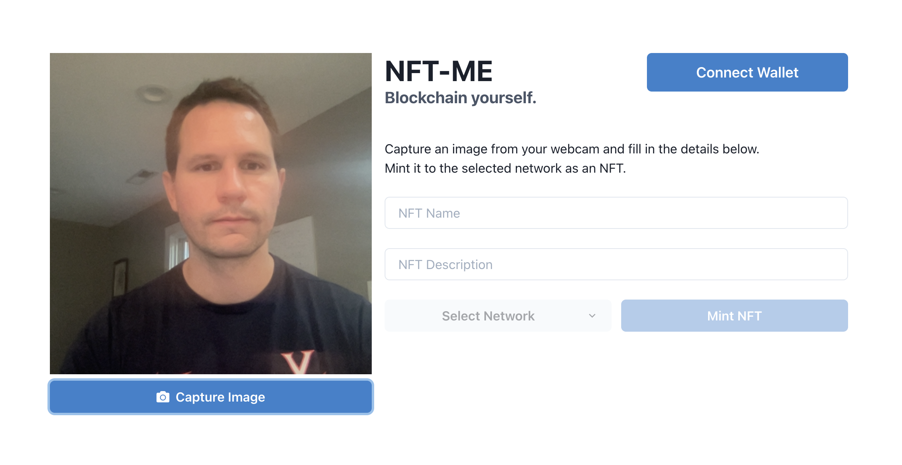

# NFT-Me
NFT-Me is a smart contract and companion web app that allows users to capture images from their webcam and mint them as NFTs. 

Included is source code for a smart contract defining an 'NFT-Me' ERC-721 token, and a React app frontend which interacts with the contract. The app provides an interface for connecting a Metamask wallet, capturing webcam images, and selecting which network to mint to.

## Setup
Node.js is required to run this application. Begin by cloning this repository and installing the required Node packages: 

```bash
# Clone this repository
git clone https://github.com/rhammell/nft-me.git

# Navigate into the repository
cd nft-me

# Install required node packages
npm install
```

Developer specific settings are required for smart contract deployment and Moralis server configuration. These settings must be defined as environment variables within an `.env` file in the root directory.

Copy the included `.env.example` template file as `.env`: 

```bash
# Copy environment variables template
cp .env.example .env
```

Update the `.env` file by replacing the default variable values with your unique developer values. The required variables are described below: 

| Variable                          | Description                                                            |
|-----------------------------------|------------------------------------------------------------------------|
| REACT_APP_MORALIS_APPLICATION_ID  | Moralis server Application ID                                          |
| REACT_APP_MORALIS_SERVER_URL      | Moralis server URL                                                     |
| MNEMONIC                          | 12 word mnemonic for wallet used to deploy contracts                   |
| POLYGON_NODE_URL                  | URL for Polygon mainnet node; Ex. Infura or Alchemy                    |
| MUMBAI_NODE_URL                   | URL for Mumbai testnet node; Ex. Infura or Alchemy                     |
| POLYGONSCAN_API_KEY               | Polygonscan.com API Key; Required for contract verification            |

Start a local development server to launch the frontend app:

```bash
# Start development server
npm start
```

Open a browser and navigate to `http://localhost:3000/` to view the application.

## Smart Contract Configuration

By default, the app is configured to interact with versions of the NFT-Me ERC-721 token contract depolyed on the following networks: 
- Polygon Mainnet: 
- Polygon Mumbai Testnet: 0xd0bB2E123A729caC9B413783bAB72572A0a17C5D

The `Truffle` directory includes an initialized Truffle project with related smart contract source code. 

Follow the steps below to deploy new copies of the NFT-Me contract to the Polygon Mainnet and Mumbai Testnet, and configure the frontend to interact with them:

```bash
# Navigate into Truffle project 
cd Truffle

# Deploy a copy of the contract to Polygon Mainnet and Mumbai Testnet
npx truffle migrate --network polygon --reset
npx truffle migrate --network mumbai --reset

# Verify the contracts on each explorer
npx truffle run verify NFTMe --network polygon
npx truffle run verify NFTMe --network mumbai

# Copy contract details into frontend 
node scripts/copyContractInfo.js
```

## Usage
An example of the app interface is shown below: 
<div align="center">
  
  <p>NFT-Me Interface<p>
</div>

When first navigating to the app, users will be prompted by their browser to grant the app access to their computer's webcam. Once permission is granted, a live feed of the webcam is shown. 


Mint an NFT with the following steps:

1. Connect Wallet - Click the 'Connet Wallet' button to connect your MetaMask wallet to the application and sign an authenication transaction.
2. Capture Image - Click the 'Capture Image' button to collect a snapshot from your webcam. Default name and description details will be filled in, which can be edited.
3. Select Network - Click the 'Select Network' dropdown to choose which network contract to mint to. MetaMask will prompt you to switch to the selected network if not already connected to it. 
4. Mint NFT - Click 'Mint NFT' to 

